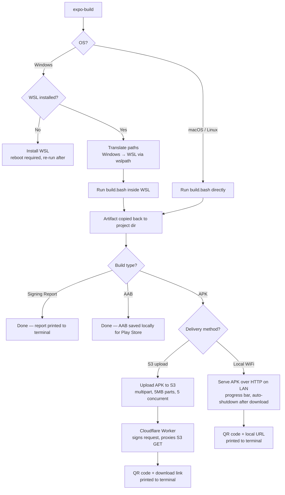

# expo-build

> A WSL-powered build wrapper for Expo / React Native Android builds — built to escape Windows path-length hell.

## The problem

Building an Expo/React Native Android app on Windows with a pnpm monorepo (especially a Turborepo setup) reliably runs into Windows' ~260 character `MAX_PATH` limit. pnpm's deeply nested `node_modules` symlink structure, combined with Gradle/CMake/NDK build artifacts that append their own long suffixes on top, pushes path lengths past what NTFS and most Windows tooling can handle — resulting in cryptic `ENAMETOOLONG` errors, "filename too long" failures, or CMake builds that fail mid-way for no obvious reason.

The actual fix isn't a registry tweak or a shorter project folder name — it's getting the project off NTFS entirely and onto a filesystem with no such limit.

## What this tool does

`expo-build` is a small Go CLI with three parts:

1. **`main.go`** — the CLI entrypoint. Detects the OS, manages WSL (checking for it, installing it if missing), translates Windows paths to WSL paths, orchestrates the build, and optionally uploads the resulting APK/AAB to S3-compatible storage with a QR code download link.
2. **`build.bash`** — the actual build logic, embedded into the Go binary at compile time via `//go:embed`. This is the single source of truth for what "building the app" means, and it's what actually runs (inside WSL on Windows, or directly on macOS/Linux).
3. **Cloudflare Worker** — a thin authenticated proxy that sits in front of a private S3 bucket, so the QR code / download link handed to a phone never needs to expose raw AWS credentials or require a public bucket.

### On Windows
- Detects whether WSL is installed; if not, installs it (requires admin rights and a reboot, after which you re-run the tool).
- Translates the script path and project path from Windows paths to WSL paths via `wslpath`.
- Runs `build.bash` inside WSL — this is the key trick. The script `tar`-pipes the project into `~/build`, *inside WSL's native ext4 filesystem*, where there is no practical path length limit. The entire install → prebuild → Gradle build pipeline then runs there instead of on the mounted Windows drive.
- Copies the finished artifact back out to the original Windows project directory.
- For APKs, you choose how to deliver to a device: over local WiFi (no internet needed) or via an S3 upload with a shareable QR link.

### On macOS / Linux
- Skips WSL entirely and just runs `build.bash` directly against the native filesystem, since the path-length problem doesn't exist there.
- Finishes once the artifact is in the project directory.

## Architecture



## Features

- Cross-platform entrypoint: Windows routes through WSL, macOS/Linux build natively.
- Automatic WSL detection and installation.
- Auto-detection of required Android SDK versions (`compileSdk`, `buildToolsVersion`, `ndkVersion`) from the project's `android/build.gradle`, with sensible defaults.
- Automatic Android SDK provisioning inside WSL if it isn't already set up (cmdline-tools, licenses, platform, build-tools, NDK).
- Support for three build types: **Debug**, **Production**, and **Signing Report**.
- Support for two output formats: **APK** (direct sideload) and **AAB** (Play Store upload).
- Two APK delivery options, chosen before the build starts so there's no waiting for input after a long compile:
  - **Local network (WiFi)** — serves the APK from a temporary HTTP server on the LAN; auto-shuts down after the device downloads it. No internet required.
  - **S3 upload** — streams the APK to S3-compatible storage and prints a scannable QR link via a Cloudflare Worker.
- Monorepo/Turborepo support: walks the directory tree to find Expo projects, prompts if multiple are found.
- Package manager auto-detection from lockfile (`pnpm-lock.yaml`, `yarn.lock`, `package-lock.json`, `bun.lock`), defaulting to npm.
- Conservative Gradle JVM/worker limits auto-injected into `gradle.properties` to avoid OOM crashes inside memory-constrained WSL VMs.
- Persistent per-project identity via `expo-build.toml` (a UUID `app_id`, generated on first run, used to namespace S3 keys).
- Streaming multipart S3 upload (5 MB parts, 5 concurrent) with a terminal progress bar.
- QR code generation for both local and S3 delivery paths.
- Build-time secrets (S3 bucket, AWS keys/region/endpoint) injected via `-ldflags` rather than hardcoded into source.

## Prerequisites

- Go 1.21+ — only needed to build the CLI itself, not to use the compiled binary.
- **Windows:** hardware/OS version capable of running WSL2. The tool will install WSL automatically if it's missing, but a reboot is required afterward.
- **macOS/Linux:** Java and the Android SDK already configured on `PATH` — `build.bash`'s auto-provisioning step runs inside WSL and is not triggered on these platforms.
- An Expo/React Native project using pnpm, yarn, npm, or bun.
- *(Optional, for the S3 upload/QR step)* an S3-compatible bucket and credentials, plus a deployed Cloudflare Worker pointed at that bucket.

## Installation

Build from source, optionally injecting your S3/AWS config at compile time:

```bash
git clone 
cd expo-build

go build -ldflags "\
  -X main.S3BucketName=your-bucket \
  -X main.AWSEndpoint=https://your-endpoint \
  -X main.AWSAccessKey=your-access-key \
  -X main.AWSSecretKey=your-secret-key \
  -X main.AWSRegion=your-region \
  -X main.BASE_URL=https://your-worker.your-subdomain.workers.dev" \
  -o expo-build .
```

> AWS credentials are only required if you intend to use the **S3 upload** delivery option. Choosing **Local network (WiFi)** delivery requires no credentials at all.

## Usage

From the root of your Expo/React Native project (or monorepo root):

```bash
./expo-build
```

You'll be prompted to:

1. **What would you like to do?** — Build a new APK/AAB, or upload an existing APK.
2. **Select the build type** — Debug, Production, or Signing Report.
3. **Select the output format** — APK (sideload) or AAB (Play Store). *(Skipped for Signing Report.)*
4. **How would you like to deliver the APK?** — Local network (WiFi) or S3 upload. *(APK only; asked before the build starts so no input is needed after the compile.)*

On first run, a `expo-build.toml` file is created in the project root with a generated `app_id` (a UUID used to namespace S3 upload keys per project).

### Uploading an existing APK

Select **Upload an existing APK** at the first prompt. You'll be asked for the path to the APK, then taken straight to the delivery step — no build occurs.

## What `build.bash` actually does

1. Loads a Java environment — via `sdkman` if available, otherwise falls back to `JAVA_HOME` derived from `java` on `PATH`.
2. Copies the project into `~/build` on WSL's native ext4 filesystem via `tar`, excluding `node_modules`, `.git`, `build`, `.cxx`, `Pods`, `.expo`, `.turbo`, `.next`, and `dist`.
3. Runs `expo prebuild` inside the app directory.
4. Auto-detects required SDK versions from `android/build.gradle` (`compileSdk`, `buildToolsVersion`, `ndkVersion`), falling back to `35` / `35.0.0` / `26.1.10909125` if not found.
5. Provisions an Android SDK at `~/Android/Sdk` if one doesn't exist: downloads the official Linux command-line tools, accepts licenses, and installs the detected `platform-tools`, `platforms;android-N`, `build-tools;N`, and `ndk;N`.
6. Detects the package manager from the lockfile at the workspace root (pnpm → yarn → npm → bun → npm fallback) and installs dependencies.
7. Appends Gradle memory/worker limits (`-Xmx4g`, `MaxMetaspaceSize=1g`, `workers.max=2`, caching + parallel enabled, `armeabi-v7a,arm64-v8a` only) to `android/gradle.properties`.
8. Runs the appropriate Gradle task: `assembleDebug`, `assembleRelease`, `bundleDebug`, `bundleRelease`, or `signingReport`.
9. Copies the resulting artifact back to the original project path (or prints the signing report in-place).
10. Cleans up `~/build`.

## Cloudflare Worker (download gateway)

The worker exists so the link handed out to a phone is a plain authenticated GET — it never carries AWS credentials, and the underlying S3 bucket can stay fully private.

It expects a `?q=<object-key>` query parameter, signs a GET request to S3 server-side using [`aws4fetch`](https://github.com/kotx/aws4fetch), streams the object back with the original content type/length, and sets `Content-Disposition: attachment` so the APK downloads directly rather than rendering in-browser.

**Required Worker environment variables / secrets** (set via `wrangler secret put` or the dashboard):

| Variable | Purpose |
|---|---|
| `AWS_ACCESS_KEY` | Access key used to sign the S3 GET request |
| `AWS_SECRET_KEY` | Secret key used to sign the S3 GET request |
| `AWS_REGION` | Region for the S3-compatible service |
| `AWS_ENDPOINT` | Base endpoint of the S3-compatible service |
| `S3_BUCKET_NAME` | Bucket the APKs were uploaded to |

## Configuration reference

### CLI (build-time, via `-ldflags`)

| Variable | Purpose |
|---|---|
| `main.S3BucketName` | Target bucket for APK uploads |
| `main.AWSEndpoint` | S3-compatible endpoint (AWS, R2, MinIO, etc.) |
| `main.AWSAccessKey` | Access key for upload |
| `main.AWSSecretKey` | Secret key for upload |
| `main.AWSRegion` | Region passed to the S3 client |
| `main.BASE_URL` | Base URL of the Cloudflare Worker (used to construct the download link) |

### `expo-build.toml` (generated per project)

```toml
[app]
app_id = "<generated-uuid>"
```

Used purely as an S3 key prefix to namespace uploads — one project's builds won't collide with another's in the bucket.

## Project structure

```
.
├── main.go            # CLI entrypoint: OS detection, WSL orchestration,
│                      #   path translation, APK delivery, S3 upload, QR generation
├── build.bash         # embedded via go:embed — Java/Android SDK setup,
│                      #   SDK version auto-detection, package manager detection,
│                      #   prebuild + Gradle build, artifact copy-back
├── worker/
│   └── index.ts       # Cloudflare Worker: authenticated S3 download gateway
└── expo-build.toml    # generated per project on first run
```

## Known limitations / roadmap

- **No WSL distro selection** — assumes the default WSL distro.
- **Reboot-after-WSL-install is manual** — the tool exits and asks the user to reboot and re-run rather than handling resumption automatically.
- **macOS/Linux SDK provisioning** — `build.bash` auto-provisions the Android SDK inside WSL but does not run this step on macOS/Linux, where the SDK must already be configured.
- **Local WiFi delivery is LAN-only** — both the build machine and the device must be on the same network. This is by design (no credentials needed, instant transfer), but it won't work across different networks.

## License

MIT.
