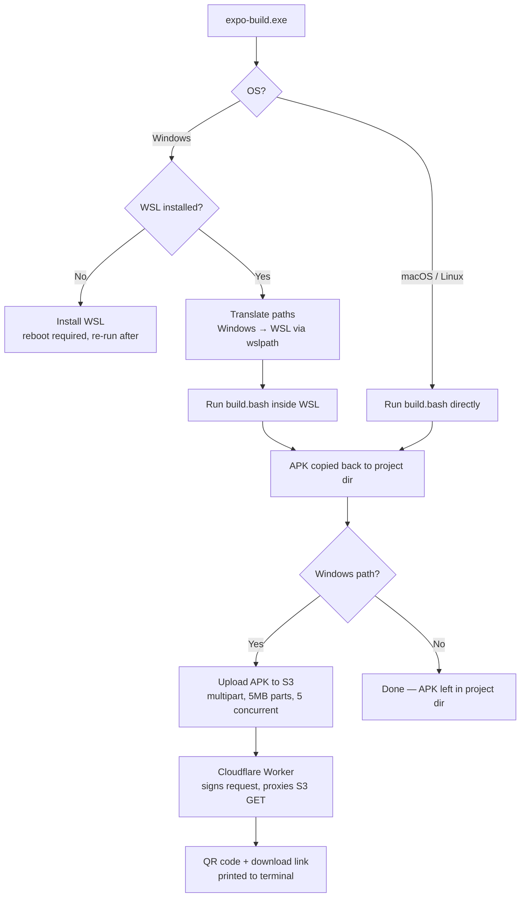

# expo-build

> A WSL-powered build wrapper for Expo / React Native Android builds — built to escape Windows path-length hell.

## The problem

Building an Expo/React Native Android app on Windows with a pnpm monorepo (especially a Turborepo setup) reliably runs into Windows' ~260 character `MAX_PATH` limit. pnpm's deeply nested `node_modules` symlink structure, combined with Gradle/CMake/NDK build artifacts that append their own long suffixes on top, pushes path lengths past what NTFS and most Windows tooling can handle — resulting in cryptic `ENAMETOOLONG` errors, "filename too long" failures, or CMake builds that fail mid-way for no obvious reason.

The actual fix isn't a registry tweak or a shorter project folder name — it's getting the project off NTFS entirely and onto a filesystem with no such limit.

## What this tool does

`expo-build` is a small Go CLI with three parts:

1. **`main.go`** — the CLI entrypoint. Detects the OS, manages WSL (checking for it, installing it if missing), translates Windows paths to WSL paths, orchestrates the build, uploads the resulting APK to S3-compatible storage, and prints a QR code + download link.
2. **`build.bash`** — the actual build logic, embedded into the Go binary at compile time via `//go:embed`. This is the single source of truth for what "building the app" means, and it's what actually runs (inside WSL on Windows, or directly on macOS/Linux).
3. **Cloudflare Worker** — a thin authenticated proxy that sits in front of a private S3 bucket, so the QR code / download link handed to a phone never needs to expose raw AWS credentials or require a public bucket.

### On Windows
- Detects whether WSL is installed; if not, installs it (requires admin rights and a reboot, after which you re-run the tool).
- Translates the script path and project path from Windows paths to WSL paths via `wslpath`.
- Runs `build.bash` inside WSL — this is the key trick. The script `tar`-pipes the project into `~/build`, *inside WSL's native ext4 filesystem*, where there is no practical path length limit. The entire install → prebuild → Gradle build pipeline then runs there instead of on the mounted Windows drive.
- Copies the finished APK back out to the original Windows project directory.
- Uploads the APK to S3 and prints a shareable link + terminal QR code (see [Known limitations](#known-limitations--roadmap) — this step is currently required on Windows, not optional).

### On macOS / Linux
- Skips WSL entirely and just runs `build.bash` directly against the native filesystem, since the path-length problem doesn't exist there.
- Finishes once the APK is in the project directory — no S3 upload on this path.

## Architecture



## Features

- Cross-platform entrypoint: Windows routes through WSL, macOS/Linux build natively.
- Automatic WSL detection and installation.
- Automatic Android SDK provisioning inside WSL if it isn't already set up (cmdline-tools, licenses, platform, build-tools, NDK).
- Package manager auto-detection from lockfile (`pnpm-lock.yaml`, `yarn.lock`, `package-lock.json`, `bun.lock`), defaulting to npm.
- Conservative Gradle JVM/worker limits auto-injected into `gradle.properties` to avoid OOM crashes inside memory-constrained WSL VMs.
- Persistent per-project identity via `expo-build.toml` (a UUID `app_id`, generated on first run, used to namespace S3 keys).
- Streaming multipart S3 upload (5 MB parts, 5 concurrent) with a terminal progress bar.
- QR code + shareable download link generation via a Cloudflare Worker, so AWS credentials never touch the client device.
- Build-time secrets (S3 bucket, AWS keys/region/endpoint) injected via `-ldflags` rather than hardcoded into source.

## Prerequisites

- Go 1.21+ — only needed to build the CLI itself, not to use the compiled binary.
- **Windows:** hardware/OS version capable of running WSL2. The tool will install WSL automatically if it's missing, but a reboot is required afterward.
- **macOS/Linux:** Java and the Android SDK already configured on `PATH` — `build.bash`'s auto-provisioning step is currently WSL-specific and does not run on these platforms.
- An Expo/React Native project using pnpm, yarn, npm, or bun.
- *(Optional, for the upload/QR step)* an S3-compatible bucket and credentials, plus a deployed Cloudflare Worker pointed at that bucket.

## Installation

Build from source, injecting your S3/AWS config at compile time:

```bash
git clone <your-repo-url>
cd expo-build

go build -ldflags "\
  -X main.S3BucketName=your-bucket \
  -X main.AWSEndpoint=https://your-endpoint \
  -X main.AWSAccessKey=your-access-key \
  -X main.AWSSecretKey=your-secret-key \
  -X main.AWSRegion=your-region" \
  -o expo-build.exe .
```

> On Windows, these values are currently **mandatory** — see [Known limitations](#known-limitations--roadmap). On macOS/Linux they're unused, since the upload step doesn't run on those platforms.

## Usage

From the root of your Expo/React Native project:

```bash
expo-build.exe
```

- On first run, a `expo-build.toml` file is created in the project root with a generated `app_id` (a UUID used to namespace S3 upload keys per project).
- **Windows:** checks for WSL → installs it if absent (you'll need to reboot once, then re-run) → translates the project and script paths into WSL paths → runs the full build inside WSL → copies the APK back to the project root → uploads it to S3 → prints a download link and a scannable QR code.
- **macOS/Linux:** runs the build script directly against the project. Finishes once `app-debug.apk` lands in the project root — no upload step.

## What `build.bash` actually does

1. Loads a Java environment — via `sdkman` if available, otherwise falls back to `JAVA_HOME` derived from `java` on `PATH`.
2. Provisions an Android SDK at `~/Android/Sdk` if one doesn't already exist: downloads the official Linux command-line tools, accepts licenses, and installs `platform-tools`, `platforms;android-36`, `build-tools;36.0.0`, and `ndk;27.1.12297006`.
3. Detects the package manager from the lockfile present in the project (pnpm → yarn → npm → bun → npm fallback).
4. `tar`-pipes the project into `~/build` on WSL's native filesystem — excluding `node_modules`, `android/.cxx`, and `android/build` — which is the actual fix for the path-length problem (a clean copy onto ext4, not a path translation trick).
5. Installs dependencies with the detected package manager.
6. Runs `npx expo prebuild`.
7. Appends Gradle memory/worker limits (`-Xmx4g`, `MaxMetaspaceSize=1g`, `workers.max=2`, caching + parallel builds enabled) to `android/gradle.properties` to avoid OOM in constrained WSL environments.
8. Runs `./gradlew assembleDebug`.
9. Copies the resulting `app-debug.apk` back to the original project path.
10. Cleans up `~/build`.

## Cloudflare Worker (download gateway)

The worker exists so the link handed out to a phone is a plain authenticated GET — it never carries AWS credentials, and the underlying S3 bucket can stay fully private.

It expects a `?q=<object-key>` query parameter, signs a GET request to S3 server-side using [`aws4fetch`](https://github.com/kotx/aws4fetch), streams the object back with the original content type/length, and sets `Content-Disposition: attachment` so the APK downloads directly rather than rendering in-browser.

**Required Worker environment variables / secrets** (set via `wrangler secret put` or the dashboard — separate from the CLI's build-time `-ldflags`):

| Variable | Purpose |
|---|---|
| `AWS_ACCESS_KEY` | Access key used to sign the S3 GET request |
| `AWS_SECRET_KEY` | Secret key used to sign the S3 GET request |
| `AWS_REGION` | Region for the S3-compatible service |
| `AWS_ENDPOINT` | Base endpoint of the S3-compatible service |
| `S3_BUCKET_NAME` | Bucket the APKs were uploaded to |

## Configuration reference

### CLI (build-time, via `-ldflags`)

| Variable | Purpose |
|---|---|
| `main.S3BucketName` | Target bucket for APK uploads |
| `main.AWSEndpoint` | S3-compatible endpoint (AWS, R2, MinIO, etc.) |
| `main.AWSAccessKey` | Access key for upload |
| `main.AWSSecretKey` | Secret key for upload |
| `main.AWSRegion` | Region passed to the S3 client |

### `expo-build.toml` (generated per project)

```toml
[app]
app_id = "<generated-uuid>"
```

Used purely as an S3 key prefix to namespace uploads — one project's builds won't collide with another's in the bucket.

## Project structure

```
.
├── main.go            # CLI entrypoint: OS detection, WSL orchestration,
│                      #   path translation, S3 upload, QR generation
├── build.bash         # embedded via go:embed — Java/Android SDK setup,
│                      #   package manager detection, prebuild + Gradle build
├── worker/
│   └── index.ts       # Cloudflare Worker: authenticated S3 download gateway
└── expo-build.toml    # generated per project on first run
```

## Known limitations / roadmap

- **S3 upload is currently mandatory on Windows.** If AWS credentials weren't injected at compile time, the binary panics *after* a successful build rather than just leaving the APK in place — there's no "build-only, skip upload" path on Windows yet.
- **Worker URL is hardcoded** to `expo-build-testifywebdev.workers.dev` in `main.go` rather than being configurable via `-ldflags` like the rest of the AWS config.
- **Download links are generated as `http://`**, not `https://`.
- **Only `assembleDebug` is wired up** — no release/signed build variant yet.
- **Android SDK provisioning versions are hardcoded** (`android-36`, `build-tools;36.0.0`, `ndk;27.1.12297006`) rather than configurable per project.
- **No WSL distro selection** — assumes the default WSL distro.
- **Reboot-after-WSL-install is manual** — the tool exits and asks the user to reboot and re-run rather than handling resumption automatically.

## License

MIT.
